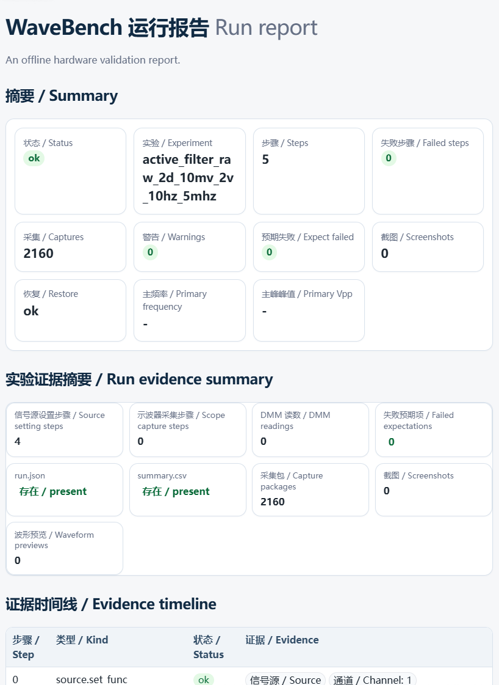
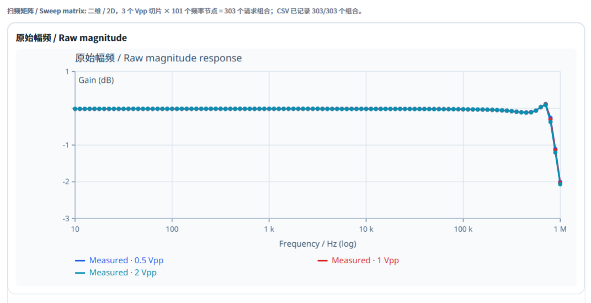
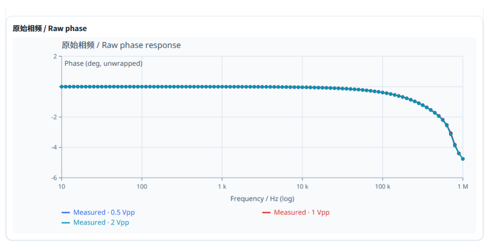
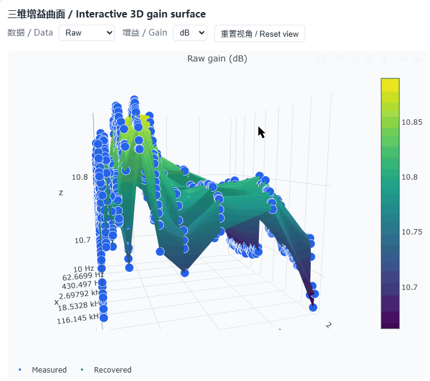
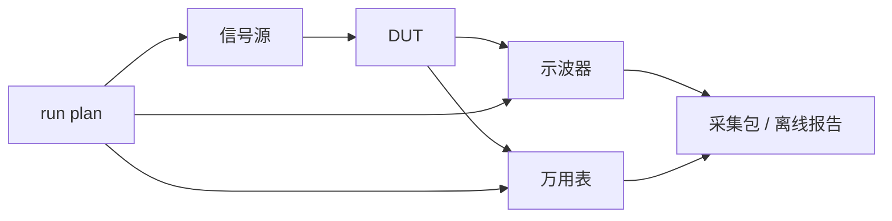

# WaveBench

[English documentation](docs/README_EN.md) · [中文文档总览](docs/README.md) · [更新日志](CHANGELOG.md) · [仪器插件仓库](https://github.com/Scaxlibur/wavebench-instrument-plugins)

> [!WARNING]
> WaveBench 可以连接并控制真实实验设备。执行会改动仪器状态的命令前，应确认接线、输入阻抗、输出状态和电压 / 电流限制。

WaveBench 是一个用 Python 编写的实验室自动测量台，面向电子设计竞赛调试和日常实验。它把仪器控制、实验步骤和采集证据放在同一条命令链中，支持先离线检查 plan，再决定是否连接硬件。

当前仓库开发线为 `0.8.22`，最新稳定 tag 为 `v0.8.0`。不同版本的命令和能力可能不同，以对应 tag 中的文档为准。

## 🌟 特别鸣谢

<p align='center'>
  <a href='https://linux.do'>
    
  </a>
</p>
<p align='center'><b>学AI，上L站！祝小破站越来越好～</b></p>

## WaveBench 适合做什么

- 把信号源、示波器、电源和万用表组合成一条可复现的实验流程。
- 保存 CSV、NPY、JSON metadata、命令记录和报告，方便复查结果。
- 用明确的命令控制输出，不在后台隐式执行 reset、autoscale 或输出切换。
- 在主包内使用常见仪器；需要其他型号时，再显式安装受信任的本地插件。

### WaveBench 特色功能

#### 测试报告

`run report` 会读取已有的 `run.json`、采集包和命令记录，生成可离线查看的 HTML 报告。报告汇总运行状态、验收结果、波形与频响分析、警告、恢复状态和原始证据链接，适合复查一次实验到底发生了什么。



#### 普通扫频

普通扫频在固定 Vpp 下沿频率轴采集 DUT 的幅频和相频响应。每条曲线对应一次固定幅值的扫频结果，便于观察通带、衰减和相位变化。





#### 二维扫频

`sweep.frequency_response` 支持「请求 Vpp × 频率」二维扫频。每个网格点保留输入与输出波形、频率响应和质量状态，可进一步生成二维校准 LUT；安装 `.[report3d]` 后，还能在 HTML 报告中查看交互式三维增益曲面。



#### 多仪器 `run plan`

显式 `run plan` 可以把信号源、示波器、电源和万用表编排到同一条实验流程中。执行前先用 `run check` 做离线校验，再用 `run verify` 做连接和安全预检；执行过程中保留每个步骤的状态、测量结果、失败证据和恢复记录。

典型流程是「信号源 → DUT → 示波器 / 万用表」。



## 先在没有仪器时跑通

下面的命令只生成和检查 plan，不会连接仪器，也不会打开输出。
示例以 Linux / WSL 为准；Windows 环境建议在 WSL 中运行。

```bash
python3 -m venv .venv
.venv/bin/python -m pip install -e .
source .venv/bin/activate

wavebench run template --list
wavebench run template source-scope-sine --output /tmp/wavebench-demo.toml --force
wavebench run check --plan /tmp/wavebench-demo.toml
```

查看终端界面时，可另外安装 TUI 依赖。`--fake` 使用模拟设备，不连接实验台：

```bash
.venv/bin/python -m pip install -e ".[tui]"
wavebench tui --fake
```

执行 plan 前，应先核对 plan 中的 source、power、scope 步骤和恢复范围。`run verify` 用于连接与安全预检，`run plan` 才会进行真实实验。

## 内建支持

| 入口 | 内建设备 | 主要用途 | 状态 |
| --- | --- | --- | --- |
| 示波器 | R&S RTM2000/RTM2032、RIGOL DS1104Z/DS1000Z | 波形读取、单次采集、多通道和截图 | 主包能力 |
| 信号源 | RIGOL DG4000/DG4202 | 基本波形、频率控制、扫频和任意波上传 | 主包能力 |
| 电源 | RIGOL DP800 | 状态、保护、设定值和输出控制 | 主包能力 |
| 万用表 | RIGOL DM3000/DM3058 | 常用读数、功能和部分量程/触发状态 | 主包能力 |
| run plan | source、power、scope、dmm、sleep、频响步骤 | 多仪器编排、质量检查和恢复 | 主入口 |
| TUI | 电源、万用表、信号源面板 | 人工查看和少量控制 | 实验性 |
| 插件 | `wavebench.instruments` 外部 driver | 添加或替换特定仪器实现 | 可选 |

详细的能力边界和参数见 [文档总览](docs/README.md)、[项目文档分类](docs/project/README.md) 及 `docs/project/reference/` 下的参考页。

## 三条常用路径

### source → scope 完整流程

先用模板生成 plan，再检查它：

```bash
wavebench run template source-scope-sine --output plans/my-sine.toml
wavebench run check --plan plans/my-sine.toml
```

确认接线、scope coupling 和安全限值后，才执行：

```bash
cp -n wavebench.example.toml wavebench.toml
# 编辑 wavebench.toml，填写当前实验台的 resource；已有配置不要覆盖
wavebench run verify --config wavebench.toml --plan plans/my-sine.toml
wavebench run plan --config wavebench.toml --plan plans/my-sine.toml
wavebench run report data/runs/<run-dir>
```

### power → DMM / scope

DP800 的设定值、保护和输出是三类独立操作。示例计划见 [plans/README.md](plans/README.md)。厂商命令和型号资料由[仪器插件仓库](https://github.com/Scaxlibur/wavebench-instrument-plugins)维护；本仓库只说明 WaveBench 的调用边界。

### 双通道频率响应

使用 `source-scope-frequency-response` 模板可以生成 reference / response 双通道扫频 plan。基础频响采集不要求额外依赖；PCHIP、平滑样条和二维校准需要 `analysis`，PDF 报告需要 `pdf`，交互式三维 HTML 需要 `report3d`。详细说明见 [run plan 使用指南](docs/project/guides/WaveBench_run_plan_使用指南.md)；执行前仍需确认真实接线。

## 命令的安全边界

| 类别 | 例子 | 说明 |
| --- | --- | --- |
| 离线 | `run schema`、`run template`、`run check`、`run report`、`capture inspect`、`tui --fake` | 不连接仪器；TUI 可能写本地日志 |
| 连接读取 | `doctor`、`idn`、`status`、`run verify` | 会查询设备；仍应把它当作有状态的 I/O |
| 修改设备 | `scope fetch/capture/autoscale`、source/power setter、output、`run plan`、非 fake TUI | 可能改变设置、触发采集或切换输出 |

WaveBench 的默认行为包括：

- 不自动发送 `*RST`；
- 不因设定电压或幅度而自动打开输出；
- 不自动改变示波器输入阻抗；可能的 50 Ω 输入需要显式确认；
- `power set` 不改变输出开关，`power output` 不改变电压/限流设定；
- 启用 source restore 后只覆盖文档注明的 basic 状态，不能当成完整通道快照；
- HTTP MCP 的工具入口需要认证，当前只提供只读工具；`/health` 是例外，不需要 token。它不提供 raw SCPI 或输出开关。

外部 Python 插件按当前用户权限运行，不是安全沙箱。仅安装来源已确认的本地目录或 wheel；公开文档不得包含真实 IP、序列号、串口路径、凭据或实验产物。

## 按任务找文档

- 第一次安装和配置：[文档总览](docs/README.md)、[配置文件格式](docs/project/reference/WaveBench_配置文件格式.md)
- 编写和检查 run plan：[run plan 使用指南](docs/project/guides/WaveBench_run_plan_使用指南.md)
- 了解采集包和报告：[数据输出格式](docs/project/reference/WaveBench_数据输出格式.md)
- 安装或开发插件：[插件用户指南](docs/project/guides/WaveBench_可安装仪器插件.md)、[插件开发指南](docs/project/contributing/WaveBench_插件开发指南.md)
- 使用 TUI 或 HTTP MCP：[TUI 文档](docs/project/guides/WaveBench_TUI终端控制面板.md)、[HTTP MCP 文档](docs/project/guides/WaveBench_HTTP_MCP_只读接口.md)
- 查厂商命令和历史验证：见[仪器插件仓库](https://github.com/Scaxlibur/wavebench-instrument-plugins)；本仓库只保留 WaveBench 自身的接口和设计文档

目前中文文档覆盖最完整，英文入口提供安装、离线体验和安全摘要。命令、字段名和 schema 以程序输出为准。

## 开发

要求 Python 3.11 或更高版本。开发依赖和 optional extras 见 [pyproject.toml](pyproject.toml)。常用检查：

```bash
.venv/bin/python -m pip install -e ".[dev]"
.venv/bin/ruff check .
.venv/bin/python -m pytest -q
```

## 许可证与致谢

WaveBench 使用 MIT 许可证。感谢 Linux DO 社区提供交流和支持。
